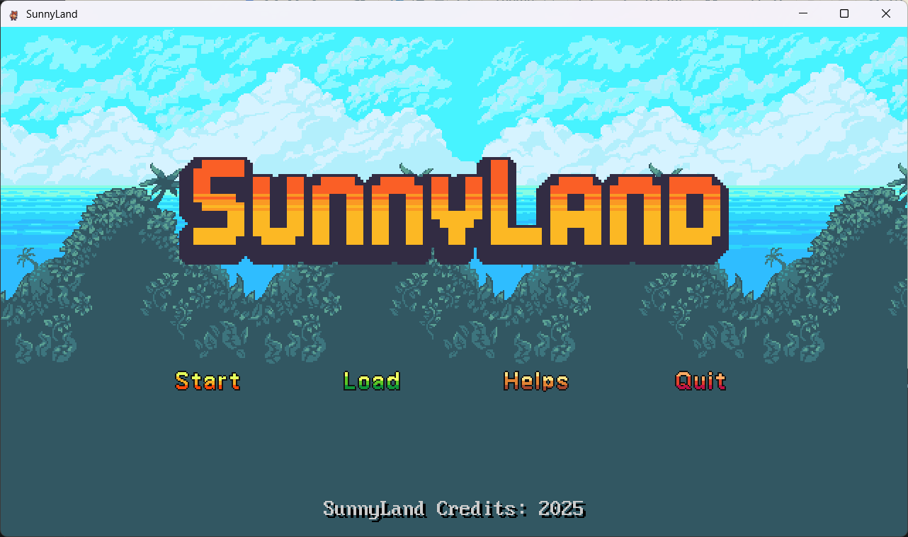
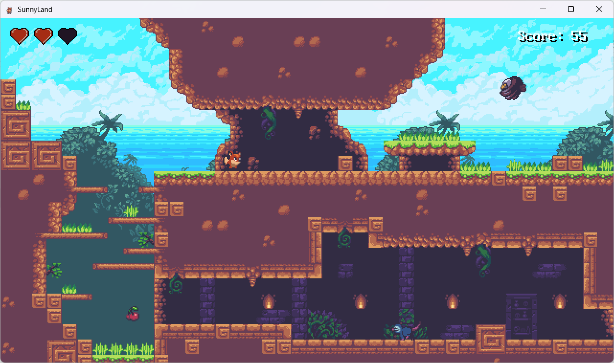
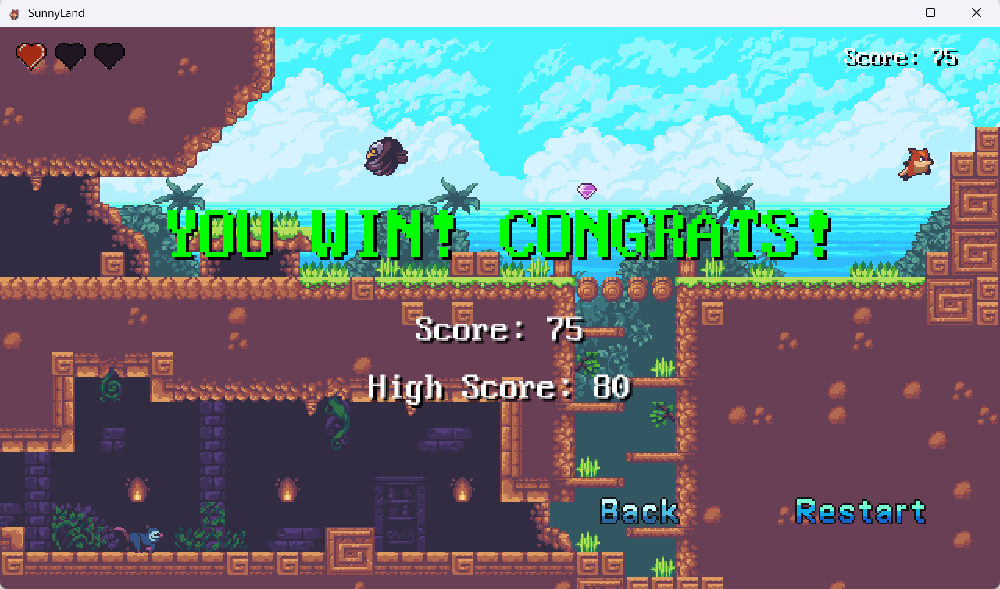
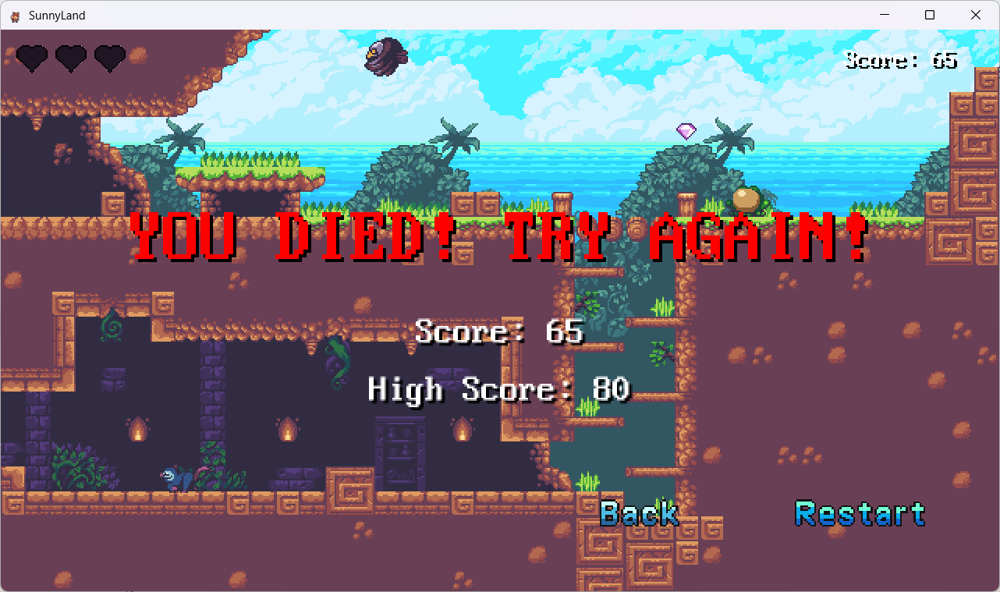
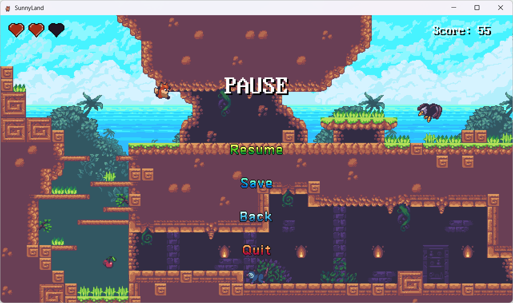
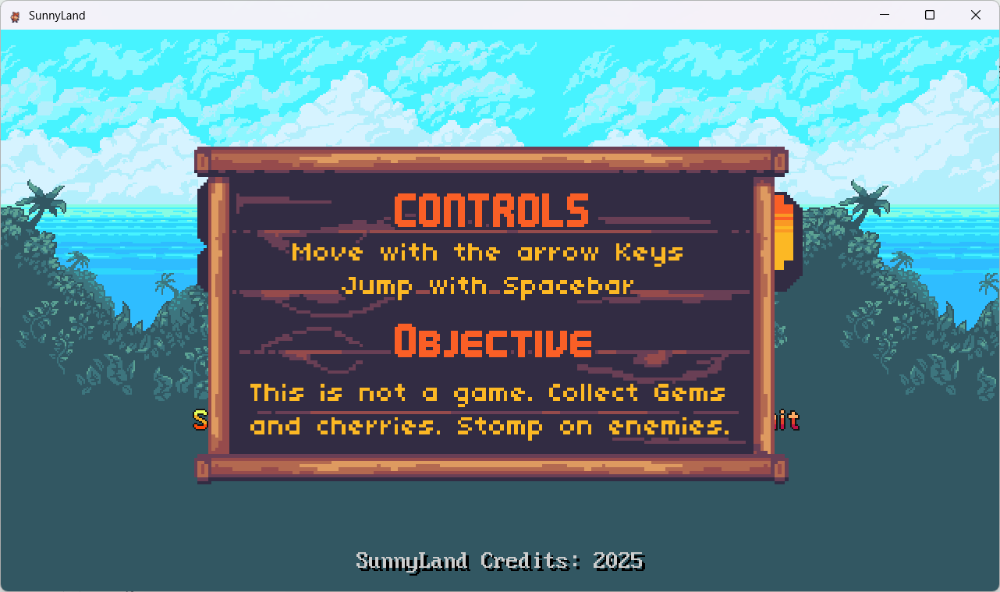

# SunnyLand

教程来自：[https://github.com/WispSnow/SunnyLand](https://github.com/WispSnow/SunnyLand)

## 游戏截图

## 游戏玩法

使用 W A S D 键控制角色移动，使用 K 键或空格键进行跳跃

## Third-party libraries

* [SDL3](https://github.com/libsdl-org/SDL)
* [SDL3_image](https://github.com/libsdl-org/SDL_image)
* [SDL3_mixer](https://github.com/libsdl-org/SDL_mixer)
* [SDL3_ttf](https://github.com/libsdl-org/SDL_ttf)
* [glm](https://github.com/g-truc/glm)
* [nlohmann-json](https://github.com/nlohmann/json)
* [spdlog](https://github.com/gabime/spdlog)

## Credits

* sprite
  * <https://ansimuz.itch.io/sunny-land-pixel-game-art>
* FX
  * <https://ansimuz.itch.io/sunny-land-pixel-game-art>
* font
  * <https://timothyqiu.itch.io/vonwaon-bitmap>
* UI
  * <https://markiro.itch.io/hud-asset-pack>
  * <https://bdragon1727.itch.io/platformer-ui-buttons>
* sound
  * <https://taira-komori.jpn.org/>
  * <https://pixabay.com/sound-effects/dead-8bit-41400/>
  * <https://pixabay.com/sound-effects/cartoon-jump-6462/>
  * <https://pixabay.com/zh/sound-effects/frog-quak-81741/>
  * <https://mmvpm.itch.io/platformer-sound-fx-pack>
  * <https://kasse.itch.io/ui-buttons-sound-effects-pack>
* music
  * <https://ansimuz.itch.io/sunny-land-pixel-game-art>
